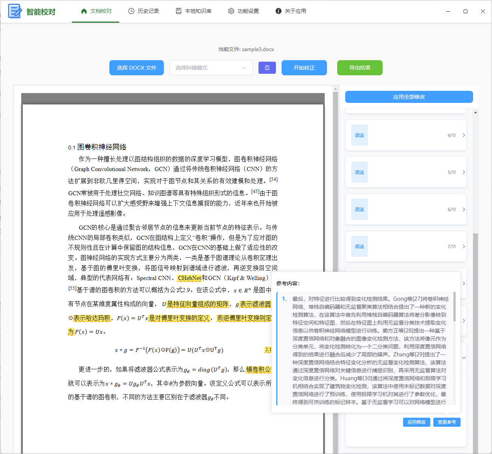
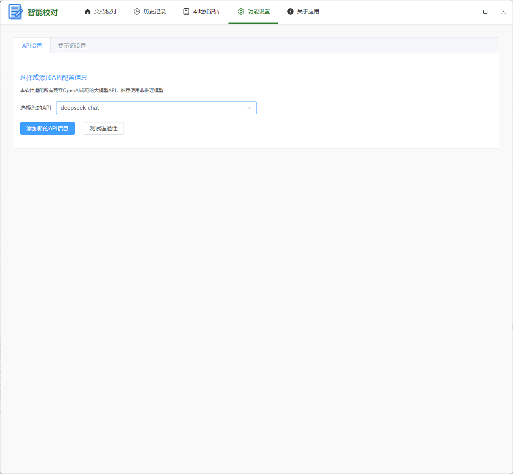
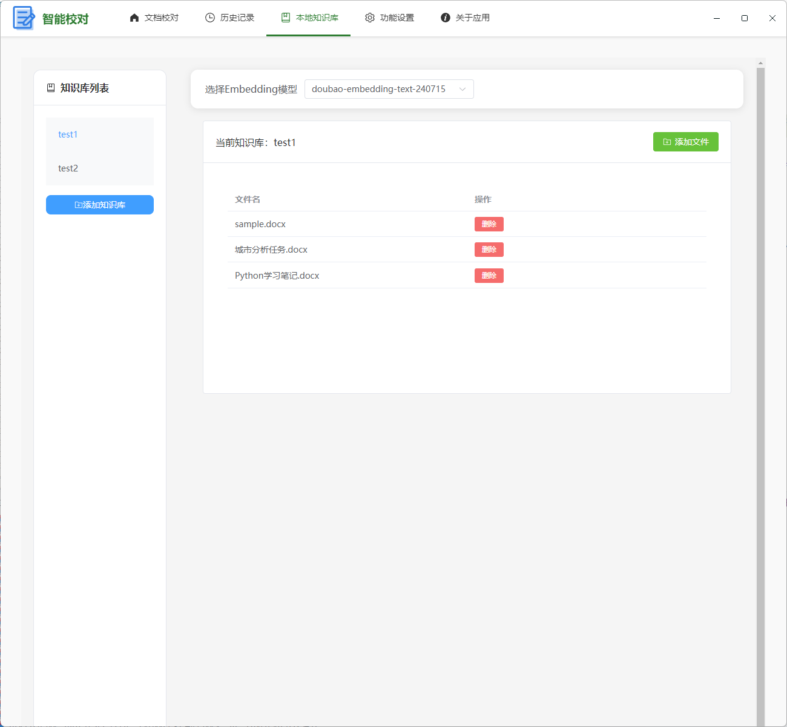

# AutoDocxProof 智能文档校对应用

<p align="center">
  
</p>

<p align="center">
  一款基于 Electron、Vue 3 和 TypeScript 构建的智能长文档校对桌面应用程序
</p>

## 📝 项目简介

AutoDocxProofread（智能校对）是一款专为长文档校对而设计的桌面应用程序。它能够帮助用户有效检测 Word 文档中的错别字、标点符号错误、语法问题和文本一致性问题，并提供修改建议。

针对大模型在处理长文档时存在的遗忘和幻觉问题，软件设计了专门的架构来增强校对的准确性，并能直接导出校对后的文档。并且软件采用了并行处理架构，显著提升大模型处理长文档的速度。新版本引入了本地知识库功能，支持RAG功能给模型校对参考。

### 核心功能与软件优势

- **多种校对模式**：

  - 逐句精校：适合需要高精度校对的短文本
  - 逐段校正：适合长篇文献的校对
  - 全文润色：对整篇文档进行语言润色和优化

- **智能错误识别**：

  - 错别字检测
  - 标点符号错误识别
  - 语法问题检测

- **知识库系统**：

  - 创建和管理多个本地知识库
  - 支持PDF、word和txt文档导入作为参考材料
  - 基于向量数据库的RAG检索增强生成算法

- **更快的处理速度和用户友好的操作体验**：

  - 使用并行处理的方式优化处理效率，显著提升对于长文本的校对速度
  - 清晰的错误展示和修改建议
  - 一键应用修改建议
  - 响应式设计，支持窗口缩放

- **便捷的 API 配置管理**：

  - 兼容openai接口，支持多种大语言模型 API
  - 灵活的 API 配置管理

- **清晰的历史记录管理**：
  - 清晰查看历史记录，包括时间、校对模型、校对文件路径和具体的结果
  - 支持对结果的批量管理

### 使用展示

用户需要先在功能设置页面选择一个大模型后再开始校对操作。在文档校对页面，首先选择需要校对的文档后，再选择校对模式，选择使用的知识库（非必选），然后开始校对。软件会将校对的结果显示在右边栏，并在文本中高亮展示，以方便查看。然后可以选择是否接受这些修改，可以导出接受修改后的文档：



本应用可以自行设置api，兼容满足openai规范的api接口，推荐使用非推理模型：



本应用还可以浏览和管理校对记录：


知识库管理界面：



> 注意：校对结果的准确度很大程度上取决于模型能力，软件无法保证校对结果的完全准确，还需要人工再次检验。

> 提示1：结果导出功能尚不完善，无法精准的将所有的结果应用到文档中，可能存在疏漏。

> 提示2：全文润色功能适合较短篇幅的文档。逐句校对对token的消耗很大。

## 🛠 技术栈

- **主框架**：[Electron](https://www.electronjs.org/) + [Vue 3](https://vuejs.org/) + [TypeScript](https://www.typescriptlang.org/)
- **UI 组件库**：[Element Plus](https://element-plus.org/)
- **构建工具**：[Vite](https://vitejs.dev/) + [Electron Forge](https://www.electronforge.io/)
- **文档处理**：[Mammoth](https://github.com/mwilliamson/mammoth.js) + [Docxtemplater](https://github.com/open-xml-templating/docxtemplater)
- **向量数据库**：[LanceDB](https://lancedb.com/)
- **代码规范**：[ESLint](https://eslint.org/) + [Prettier](https://prettier.io/)
- **版本管理**：[Standard Version](https://github.com/conventional-changelog/standard-version)

## 🚀 快速开始

### 环境要求

- Node.js >= 16.x
- npm 或 yarn

### 安装依赖

```bash
npm install
```

### 开发模式运行

```bash
npm run start
```

## 📦 项目结构

```
.
├── src/
│   ├── main/              # 主进程代码
│   │   ├── chat.ts        # AI 对话相关功能
│   │   ├── database.ts    # 数据库操作
│   │   ├── ipcHandlers.ts # IPC 通信处理
│   │   ├── lancedb.ts     # 向量数据库操作
│   │   ├── main.ts        # 主进程入口
│   │   ├── pdfUtils.ts    # PDF文档处理
│   │   ├── preload.ts     # 预加载脚本
│   │   ├── proof.ts       # 文档校对核心逻辑
│   │   └── wordProcess.ts # Word 文档处理
│   └── renderer/          # 渲染进程代码
│       ├── router/        # 路由配置
│       ├── stores/        # Pinia存储目录
│       ├── views/         # 页面组件
│       ├── App.vue        # 根组件
│       └── renderer.ts    # 渲染进程入口
├── assets/                # 静态资源
├── out/                   # 构建输出目录
└── forge.config.ts        # Electron Forge 配置
```

## 🎯 使用指南

### 1. 配置 API

首次使用需要配置支持的大语言模型 API：

1. 点击导航栏中的"工作区"
2. 选择"API 设置"选项卡
3. 填写 API 地址、密钥和模型名称
4. 点击"测试连接"验证配置
5. 点击"保存配置"保存设置

### 2. 创建知识库

1. 点击导航栏中的"知识库"
2. 选择"Embedding模型"（需要选择专门的embedding模型）
3. 点击"添加知识库"按钮创建新知识库
4. 选择知识库后可添加PDF文件作为参考材料

### 3. 文档校对

1. 点击导航栏中的"工作区"
2. 选择"文档校对"选项卡
3. 点击"选择 DOCX 文件"按钮选择要校对的 Word 文档
4. （可选）选择知识库以增强校对准确性
5. 选择合适的校对模式：
   - **逐句精校**：适合需要高精度校对的短文本
   - **逐段校正**：适合长篇文献的校对
   - **全文润色**：对整篇文档进行语言润色和优化
6. 点击"开始校正"按钮开始校对过程
7. 在右侧栏查看校对结果和修改建议
8. 点击"应用修改"按钮接受建议的修改
9. 点击"导出结果"按钮保存修改后的文档

## 🔧 开发计划

1. 大语言模型的格式化输出转word文档
2. 增强用户界面交互体验
3. 优化.docx文件的处理算法

## 📖 版本情况

当前版本：v1.1.0

v1.1.0版本的.exe包已经发布，可以在本项目页面上下载
项目地址：https://github.com/CZ600/AutoDocxProofread

## 📄 许可证

本项目采用 MIT 许可证 - 查看 [LICENSE](LICENSE) 文件了解详情

## 致谢

部分代码使用了night-peiqi的https://github.com/night-peiqi/electron-vue3-typescript-template
