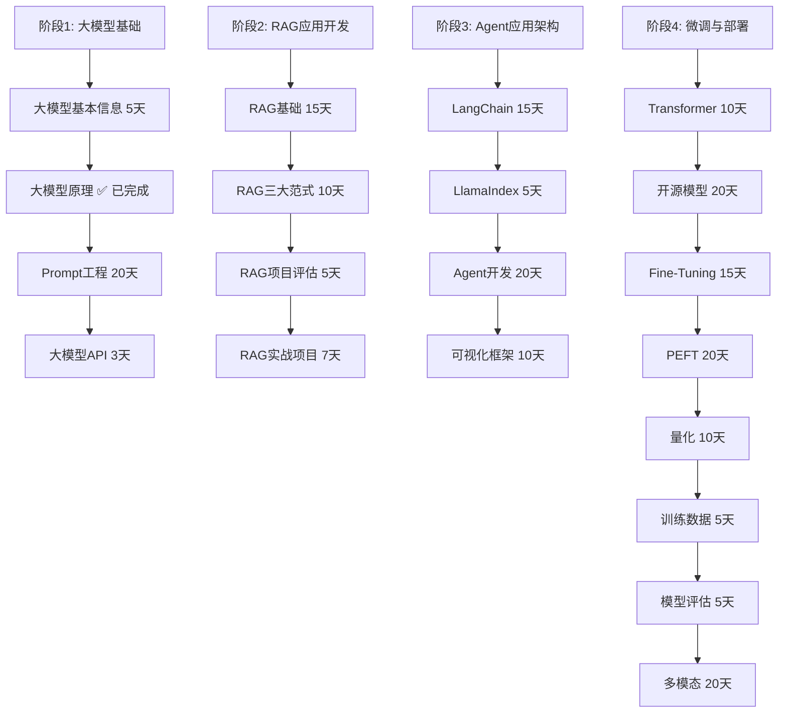

# AI大模型应用开发学习路线规划

> **规划时间**: 2025年11月1日
> **学习者背景**: Java后端开发工程师，掌握SpringBoot+Vue技术栈
> **当前进度**: ✅ 已完成"大模型原理"学习（60天）
> **目标**: 成为具备AI模型应用开发能力的全栈工程师

---

## 📋 总体学习路线图



---

## 🎯 阶段1: 大模型基础（剩余23天）

> **已完成**: ✅ 大模型原理（60天）
> **当前阶段**: 准备开始Prompt工程学习

### 1.1 大模型基本信息（5天）

**学习目标**: 快速建立对大模型的整体认知

**核心内容**:
- **Day 1-2**: 大模型发展史
  - 发展历程：GPT-1 → GPT-2 → GPT-3 → GPT-4 → DeepSeek系列
  - 里程碑事件和技术突破
  - 主流模型对比分析（GPT、Claude、DeepSeek、LLaMA等）

- **Day 3-4**: 模型分类与应用场景
  - 基座模型 vs 对话模型
  - 通用模型 vs 专业模型
  - 不同模型的特长（代码、推理、知识、创作等）
  - 模型选择策略

- **Day 5**: 模型能力与局限性
  - 能力边界认知
  - 常见失败场景
  - 成本与性能权衡

**实践项目**:
- 创建一个主流模型对比表
- 针对不同场景选择合适的模型

### 1.2 Prompt工程（20天）⭐⭐⭐⭐⭐

> **重要性**: 这是将理论转化为生产力的关键技能！

**Day 1-3: Prompt基础**
- 提示词的基本概念和作用机制
- 提示词的结构化写法
- 角色设定、任务描述、输出格式
- 优质Prompt的基本原则

**Day 4-7: Prompt进阶技巧**
- 少样本学习（Few-shot）
- 链式思维（Chain of Thought, CoT）
- 思维树（Tree of Thought, ToT）
- 提示词优化方法

**Day 8-12: Java应用场景**
- 与SpringBoot集成设计
- 提示词模板设计
- 动态Prompt生成
- 提示词版本管理
- 提示词测试框架

**Day 13-17: 高级Prompt技巧**
- 自洽性校验
- 反思与自我修正
- 提示词链式调用
- 多轮对话上下文管理
- Prompt攻击与防护

**Day 18-20: 实战项目**
- 智能客服系统（电商场景）
- 代码审查助手
- 文档生成系统

**推荐资源**:
- 《Prompt Engineering Guide》
- OpenAI Cookbook
- Anthropic Prompt Engineering资源

### 1.3 大模型API（3天）

**学习目标**: 快速上手主流模型API

**Day 1: OpenAI API**
- API接口规范
- SDK使用（Python/Java）
- 计费与Token管理
- 错误处理与重试机制

**Day 2: DeepSeek API & 其他主流API**
- DeepSeek API使用
- Claude API
- 国产模型API（智谱GLM、文心一言、通义千问等）
- API代理与负载均衡

**Day 3: 实际应用开发**
- SpringBoot集成大模型API
- API调用封装
- 流式响应处理
- 多模型切换策略

**实践项目**:
- 开发一个统一的大模型API调用框架
- 实现智能问答后端服务

---

## 🚀 阶段2: RAG应用开发工程（37天）

> **核心价值**: 打造企业内部知识库应用，解决大模型知识截止问题

### 2.1 RAG基础（15天）

**Day 1-3: RAG原理与架构**
- RAG工作原理
- 向量数据库概念
- 文档分块策略
- 检索与生成流程

**Day 4-6: 向量数据库选型与使用**
- Chroma
- Pinecone（云服务）
- Weaviate
- Qdrant
- FAISS
- **Java开发者注意**: 这些数据库大多数是Python生态，需要设计中间层接口

**Day 7-10: 文档处理与索引**
- 文档加载与预处理
- 文本分块技术（按长度、按语义、按结构）
- 文本向量化
- 索引构建与优化
- 元数据管理

**Day 11-13: 检索策略优化**
- 稠密检索（Dense Retrieval）
- 稀疏检索（Sparse Retrieval）
- 混合检索（Hybrid Search）
- 重排序（Rerank）
- 多阶段检索

**Day 14-15: RAG评估方法**
- 检索质量评估
- 生成质量评估
- RAGAS评估框架
- 端到端性能测试

### 2.2 RAG三大范式（10天）

**Day 1-3: Naive RAG（基础RAG）**
- 简单检索增强生成
- 适用场景
- 局限性分析
- 基础实现方案

**Day 4-6: Advanced RAG（高级RAG）**
- Multi-Query
- RAG-Fusion
- Self-RAG
- Corrective RAG（CRAG）
- 优化技巧

**Day 7-8: Modular RAG（模块化RAG）**
- 模块化设计思想
- 模块组合策略
- 自定义RAG Pipeline
- 可插拔组件设计

**Day 9-10: 范式对比与选择**
- 不同范式的适用场景
- 性能对比分析
- 实际项目中的选择策略

### 2.3 RAG项目评估（5天）

**Day 1-2: 评估指标体系**
- 检索评估指标（Recall, Precision, MRR）
- 生成评估指标（BLEU, ROUGE, BERTScore）
- 端到端评估
- 人工评估方法

**Day 3-4: 评估工具与平台**
- RAGAS使用
- TruLens
- DeepEval
- 构建自定义评估管道

**Day 5: 评估实践**
- 制定评估标准
- 设计评估数据集
- 执行评估流程
- 结果分析与优化

### 2.4 RAG实战项目（7天）

**项目选择**: 选一个实际业务场景

**推荐项目**:
1. **企业知识库问答系统**
   - 背景：企业内部文档问答
   - 技术栈：SpringBoot + Elasticsearch + DeepSeek API
   - 功能：文档上传、向量化、智能问答

2. **产品文档智能助手**
   - 背景：产品文档查询与支持
   - 技术栈：SpringBoot + Pinecone + Vue
   - 功能：多文档类型支持、版本管理、权限控制

**Day 1-2: 项目设计与环境搭建**
- 需求分析
- 架构设计
- 技术选型
- 开发环境搭建

**Day 3-5: 核心功能开发**
- 文档上传与预处理
- 向量化存储
- 检索功能
- 生成功能

**Day 6-7: 优化与部署**
- 性能优化
- 前端开发（Vue）
- 部署上线
- 用户测试与反馈

---

## 🤖 阶段3: 大模型Agent应用架构（50天）

> **核心价值**: 构建智能化业务助手，实现复杂任务自动化

### 3.1 LangChain（15天）

**Day 1-3: LangChain基础**
- 核心概念（Chain, Agent, Memory等）
- 架构设计理念
- 与SpringBoot集成策略
- Java生态适配方案

**Day 4-6: 核心组件**
- Models（模型接口）
- Prompts（提示词模板）
- Chains（链式调用）
- Retrievers（检索器）
- Memory（记忆模块）

**Day 7-10: Agent开发**
- Agent的推理循环
- 工具调用（Tool Calling）
- ReAct框架
- Plan-and-Execute
- 多Agent协作

**Day 11-13: 高级功能**
- 回调机制（Callbacks）
- 流式处理
- 异步调用
- 并行执行
- 错误处理与重试

**Day 14-15: 实战项目**
- 开发一个数据分析Agent
- 构建多工具调用的业务助手

### 3.2 LlamaIndex（5天）

**Day 1-2: LlamaIndex核心概念**
- Index类型与选择
- 数据连接器
- 索引构建与查询
- 与LangChain对比

**Day 3-4: 实际应用**
- 知识图谱集成
- 结构化数据处理
- 多模态数据索引
- 实时数据更新

**Day 5: 对比分析**
- LangChain vs LlamaIndex适用场景
- 技术选型决策树

### 3.3 Agent开发（20天）

**Day 1-4: Agent基础理论**
- Agent的定义与分类
- 认知架构（Cognitive Architecture）
- Agent vs 传统程序
- Agent的设计原则

**Day 5-8: Agent核心能力**
- 工具使用（Tool Use）
- 推理与规划（Reasoning & Planning）
- 记忆与学习（Memory & Learning）
- 多模态处理能力

**Day 9-12: Agent框架与平台**
- AutoGPT
- LangGraph
- Microsoft Autogen
- 开源Agent框架对比
- 企业级Agent平台选型

**Day 13-17: 实战开发**
- **推荐项目**: 智能开发助手
  - 功能：代码生成、代码审查、测试用例生成
  - 技术栈：SpringBoot + LangChain + DeepSeek API
  - 特点：多工具协作、知识库集成、代码审查能力

**Day 18-20: Agent优化与安全**
- Agent安全防护
- Prompt注入防护
- 输出内容过滤
- Agent行为监控
- 成本控制策略

### 3.4 可视化开发框架/Agent IDE（10天）

**Day 1-3: 前端框架选型**
- React vs Vue在AI应用中的对比
- 流式UI设计
- 实时交互组件
- 状态管理

**Day 4-6: Agent开发平台**
- LangFlow
- Flowise
- Dify
- 开源Agent平台对比
- 自研vs直接使用

**Day 7-8: 调试与监控**
- LangSmith
- Agent行为追踪
- 性能监控
- 日志分析

**Day 9-10: 实战项目**
- 构建一个可视化Agent搭建平台
- 实现拖拽式Agent编排

---

## ⚙️ 阶段4: 大模型微调与私有化部署（130天）

> **核心价值**: 打造专属模型，实现数据安全与成本优化

### 4.1 Transformer架构深入（10天）

**Day 1-3: Transformer源码解析**
- Encoder-Decoder架构
- Attention实现细节
- 位置编码深度解析
- 多头注意力机制

**Day 4-6: 现代Transformer变体**
- GPT系列架构演进
- BERT架构特点
- T5架构设计
- **重要**: Multi-Head Latent Attention (MLA) 深入理解
- Mixture of Experts (MoE)

**Day 7-8: 训练技巧**
- 梯度累积
- 混合精度训练
- 分布式训练
- ZeRO优化器

**Day 9-10: Java生态支持**
- DeepLearning4J
- Tribuo（Oracle的ML库）
- 与Python模型交互方案

### 4.2 开源模型（20天）

**Day 1-4: 国外主流开源模型**
- LLaMA系列（LLaMA, Llama2, Code Llama）
- Mistral系列
- DeepSeek系列
- Qwen系列
- ChatGLM系列
- Baichuan系列

**Day 5-8: 模型能力对比**
- 代码生成能力
- 数学推理能力
- 中文理解能力
- 多语言支持
- 推理速度对比
- 内存占用对比

**Day 9-12: 模型选择策略**
- 业务场景匹配
- 硬件资源评估
- 成本效益分析
- 微调可行性评估

**Day 13-16: 模型获取与部署**
- Hugging Face使用
- 模型下载与缓存
- 本地部署方案
- 推理引擎选型（vLLM, TensorRT-LLM等）

**Day 17-20: 实战项目**
- 部署多个开源模型
- 构建模型对比测试平台
- 性能基准测试

### 4.3 Fine-Tuning（模型微调）（15天）

**Day 1-3: 微调基础理论**
- 什么时候需要微调
- 全量微调 vs 部分微调
- LoRA适配器
- 微调数据准备

**Day 4-6: 数据准备与清洗**
- 指令跟随数据格式
- 数据质量评估
- 数据增强技术
- 多轮对话数据处理

**Day 7-9: 微调实践**
- 使用Transformers库
- 使用DeepSpeed
- 参数配置优化
- 训练监控

**Day 10-12: 微调评估**
- 评估指标选择
- A/B测试设计
- 人工评估
- 自动化评估工具

**Day 13-15: Java微调生态**
- Tribuo微调支持
- Spring AI集成微调模型
- 模型服务化

### 4.4 PEFT（参数高效微调）（20天）

**Day 1-3: PEFT理论基础**
- LoRA原理与实现
- QLoRA
- AdaLoRA
- IA3
- P-tuning v2

**Day 4-7: LoRA深度实战**
- LoRA超参数调优
- LoRA代码实现
- LoRA在生产环境中的应用
- LoRA版本管理

**Day 8-10: QLoRA**
- 量化感知训练
- 4bit训练技术
- 内存优化策略
- 精度与速度权衡

**Day 11-14: 高级PEFT技术**
- DoRA（权重解耦适应）
- 组合式微调
- 提示学习（Prompt Tuning）
- 前缀学习（Prefix Tuning）

**Day 15-17: PEFT实践项目**
- 为特定领域训练LoRA适配器
- 多任务LoRA训练
- LoRA模型压缩与部署

**Day 18-20: 性能优化**
- 推理加速技术
- 批量推理优化
- 缓存策略
- 动态加载适配器

### 4.5 量化（10天）

**Day 1-3: 量化基础理论**
- 量化原理
- INT8量化
- INT4量化
- 动态量化 vs 静态量化
- 量化感知训练（QAT）

**Day 4-6: 实践工具**
- ONNX量化
- TensorRT量化
- GGML量化
- AWQ量化
- GPTQ量化

**Day 7-8: 量化后处理**
- 模型转换
- 推理引擎集成
- 性能测试
- 精度损失评估

**Day 9-10: 生产部署**
- Java量化模型推理
- 量化模型压缩
- 分布式推理

### 4.6 语言模型训练数据（5天）

**Day 1-2: 数据来源与采集**
- 开源数据集
- 网页爬取
- API数据收集
- 版权与合规问题

**Day 2-4: 数据清洗与标注**
- 质量过滤
- 去重技术
- 敏感信息处理
- 标注流程设计

**Day 5: 数据管理**
- 数据版本控制
- 数据存储方案
- 数据血缘追踪

### 4.7 大语言模型评估（5天）

**Day 1-2: 评估框架**
- HELM评估
- Big-Bench
- SuperGLUE
- 国产评估基准

**Day 2-3: 评估维度**
- 通用能力评估
- 专业能力评估
- 安全性评估
- 偏见评估

**Day 4-5: 实战评估**
- 构建评估数据集
- 执行评估流程
- 结果分析与报告

### 4.8 Multimodal（多模态）（20天）

**Day 1-4: 多模态基础**
- 视觉-语言模型
- CLIP模型
- DALL-E系列
- GPT-4V
- LLaVA

**Day 5-8: 多模态应用开发**
- 图生文（Image Captioning）
- 文生图（Text-to-Image）
- 视觉问答（VQA）
- 文档理解（Document AI）

**Day 9-12: Java多模态应用**
- Spring Boot集成多模态模型
- 图像处理管道
- 文档解析系统
- 多模态数据流设计

**Day 13-16: 实际项目开发**
- **推荐项目**: 智能文档分析系统
  - 功能：文档OCR、内容理解、智能问答、总结生成
  - 技术栈：SpringBoot + Vue + 视觉语言模型
  - 特点：支持PDF、Word、图片等多种格式

**Day 17-20: 优化与部署**
- 多模态模型优化
- 端侧部署
- 移动端适配

---

## 📚 学习资源推荐

### 官方文档
- **OpenAI**: https://platform.openai.com/docs
- **Anthropic**: https://docs.anthropic.com
- **DeepSeek**: https://platform.deepseek.com
- **LangChain**: https://python.langchain.com
- **LlamaIndex**: https://docs.llamaindex.ai
- **Hugging Face**: https://huggingface.co/docs

### 开源项目
- **Spring AI**: https://github.com/spring-projects/spring-ai
- **RAG-Fusion**: https://github.com/AnswerDotAI/RAGFlow
- **LlamaIndex**: https://github.com/run-llama/llama_index
- **DeepSpeed**: https://github.com/microsoft/DeepSpeed
- **vLLM**: https://github.com/vllm-project/vllm

### 技术博客与社区
- 知乎AI专栏
- CSDN AI频道
- 机器之心
- AI科技大本营
- Papers With Code

---

## 💻 技术栈整合建议

### 后端技术栈（Java生态）

**核心框架**:
- Spring Boot 3.x（应用基础框架）
- Spring AI（AI模型集成框架）
- Spring Data（数据存储）
- Spring Security（安全认证）

**AI模型集成**:
- 统一API调用框架
- 模型适配器模式
- 提示词模板管理
- 流式响应处理

**数据存储**:
- 向量数据库（Chroma/Qdrant）
- 关系型数据库（PostgreSQL/MySQL）
- 缓存（Redis）
- 文件存储（MinIO/OSS）

**消息队列**:
- RabbitMQ/Kafka（异步任务）
- WebSocket（实时通信）

### 前端技术栈（Vue生态）

**核心框架**:
- Vue 3 + TypeScript
- Vue Router（路由）
- Pinia（状态管理）
- Vite（构建工具）

**UI组件库**:
- Element Plus（企业级UI）
- Ant Design Vue
- Naive UI

**AI应用特定组件**:
- 流式文本展示
- 代码高亮
- Markdown渲染
- 聊天界面组件

---

## 🎯 每个阶段的实战项目建议

### 阶段1项目
1. **智能客服助手**（Prompt工程实践）
   - 场景：电商售后
   - 技术：SpringBoot + DeepSeek API
   - 功能：多轮对话、意图识别、知识库查询

### 阶段2项目
1. **企业知识库问答系统**（RAG实战）
   - 场景：内部文档查询
   - 技术：SpringBoot + 向量数据库 + LangChain
   - 功能：文档上传、智能检索、答案生成

2. **技术文档智能助手**（RAG进阶）
   - 场景：API文档查询
   - 技术：SpringBoot + Pinecone + Vue
   - 功能：版本管理、权限控制、多文档支持

### 阶段3项目
1. **智能开发助手**（Agent实战）
   - 场景：代码生成与审查
   - 技术：SpringBoot + LangChain + 多工具协作
   - 功能：代码生成、代码审查、测试用例生成

2. **可视化Agent平台**（Agent IDE）
   - 场景：Agent搭建平台
   - 技术：Vue + Agent框架
   - 功能：拖拽式编排、流程可视化、调试工具

### 阶段4项目
1. **领域专用聊天机器人**（微调实战）
   - 场景：法律/医疗/金融咨询
   - 技术：LoRA微调 + 量化部署
   - 功能：领域知识问答、专业术语解释

2. **多模态文档理解系统**（多模态实战）
   - 场景：合同分析、票据处理
   - 技术：视觉语言模型 + OCR
   - 功能：文档解析、关键信息提取、智能摘要

---

## 📊 学习进度跟踪

### 技能树

```
大模型应用开发技能树
├── 理论掌握
│   ├── Transformer架构 ✅
│   ├── 注意力机制 ✅
│   ├── 位置编码 ✅
│   └── 大模型训练流程
├── Prompt工程
│   ├── 基础Prompt ✅
│   ├── 进阶技巧
│   ├── 业务应用
│   └── 安全防护
├── RAG应用
│   ├── 基础RAG
│   ├── 高级RAG
│   ├── 评估优化
│   └── 项目实战
├── Agent开发
│   ├── LangChain
│   ├── LlamaIndex
│   ├── 多Agent协作
│   └── 可视化平台
└── 微调部署
    ├── Transformer源码
    ├── 开源模型选型
    ├── LoRA微调
    ├── 模型量化
    └── 生产部署
```

### 月度目标建议

**第1个月**（11月）:
- 完成阶段1剩余内容（Prompt工程 + API）
- 开始RAG基础学习
- 完成智能客服助手项目

**第2个月**（12月）:
- 完成RAG全部内容
- 完成企业知识库项目
- 开始Agent开发

**第3个月**（2026年1月）:
- 完成Agent基础
- 完成智能开发助手项目
- 开始Transformer架构深入学习

**第4个月**（2026年2月）:
- 完成开源模型学习
- 开始微调实践
- 完成领域专用聊天机器人项目

---

## 💡 特别提醒

### 对于Java开发者的建议

1. **语言桥接**: Python生态的AI库丰富，需要设计中间层让Java调用
2. **性能考虑**: AI模型推理是计算密集型，需要异步处理
3. **成本控制**: API调用成本高，需要缓存和智能路由
4. **安全防护**: 需要防止Prompt注入和敏感信息泄露
5. **工程化思维**: 将AI能力封装成可复用的服务组件

### 学习技巧

1. **理论与实践结合**: 每个理论点都要用代码验证
2. **项目驱动学习**: 以实际项目为目标推进学习
3. **社区参与**: 积极参与开源项目和社区讨论
4. **持续跟踪**: AI技术发展快，需要持续关注最新进展
5. **知识沉淀**: 将学习成果整理成博客或笔记

---

## 🎓 学习成果检验

### 阶段成果检验标准

**阶段1完成标准**:
- [ ] 能够编写高质量的Prompt
- [ ] 掌握主流模型API的使用
- [ ] 完成一个智能客服系统

**阶段2完成标准**:
- [ ] 理解RAG的完整工作流程
- [ ] 能够构建企业级知识库系统
- [ ] 掌握RAG评估方法

**阶段3完成标准**:
- [ ] 能够开发多工具调用的Agent
- [ ] 掌握Agent安全防护
- [ ] 完成一个可视化Agent平台

**阶段4完成标准**:
- [ ] 能够微调和部署开源模型
- [ ] 掌握模型量化技术
- [ ] 完成一个领域专业应用

### 长期目标

**6个月后**:
- 具备独立开发AI应用的能力
- 拥有2-3个完整的项目作品
- 能够在团队中推广AI技术应用

**1年后**:
- 成为公司AI应用开发的技术负责人
- 能够指导团队进行AI项目开发
- 对AI技术有深入的理解和独特的见解

---

## 📞 学习支持

### 学习小组建议
- 加入相关技术社区
- 寻找学习伙伴
- 定期技术分享
- 参与开源项目贡献

### 问题解决渠道
- Stack Overflow
- GitHub Issues
- 技术社区论坛
- 官方文档与教程

---

**最后更新**: 2025年11月1日
**文档版本**: v1.0
**建议学习周期**: 8-10个月（按每天3-4小时计算）
