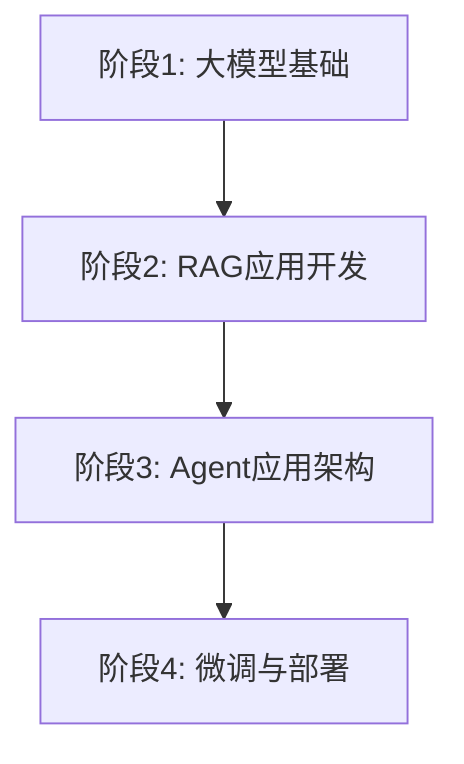

# AI大模型应用开发学习计划

> 📚 基于SpringBoot+Vue技术栈的AI应用开发完整路线

## 🎯 学习概览

**学习者背景**: Java后端开发工程师，掌握SpringBoot+Vue
**当前进度**: ✅ 已完成"大模型原理"（60天深度学习）
**总体目标**: 8-10个月掌握AI模型应用开发全栈技能

## 📋 四大学习阶段



### ⭐ 阶段1: 大模型基础（23天）
> **重点**: Prompt工程 + API使用

- **大模型基本信息**（5天）：主流模型认知
- **Prompt工程**（20天）⭐⭐⭐⭐⭐：核心技能！
- **大模型API**（3天）：主流API集成

**实战项目**: 智能客服系统（SpringBoot + DeepSeek API）

---

### 🚀 阶段2: RAG应用开发（37天）
> **重点**: 企业知识库系统构建

- **RAG基础**（15天）：向量数据库 + 检索增强
- **RAG三大范式**（10天）：Naive/Advanced/Modular RAG
- **项目评估**（5天）：RAG质量评估方法
- **实战项目**（7天）：企业知识库问答系统

**实战项目**: 企业知识库系统（SpringBoot + Chroma + LangChain）

---

### 🤖 阶段3: Agent应用架构（50天）
> **重点**: 智能Agent系统开发

- **LangChain**（15天）：Agent开发框架
- **LlamaIndex**（5天）：知识库索引框架
- **Agent开发**（20天）：多工具协作 + 推理规划
- **可视化平台**（10天）：Agent IDE构建

**实战项目**: 可视化Agent平台（Vue + Agent框架）

---

### ⚙️ 阶段4: 微调与部署（130天）
> **重点**: 私有化模型训练与部署

- **Transformer深入**（10天）：源码解析
- **开源模型**（20天）：模型选型与部署
- **Fine-Tuning**（15天）：全量微调
- **PEFT微调**（20天）：LoRA/QLoRA
- **量化**（10天）：INT8/INT4量化
- **多模态**（20天）：视觉语言模型应用

**实战项目**: 智能文档分析系统（多模态 + 微调模型）

## 📊 预计学习时间

| 阶段 | 天数 | 核心技能 | 实战项目 |
|------|------|----------|----------|
| 阶段1 | 23天 | Prompt + API | 智能客服 |
| 阶段2 | 37天 | RAG系统 | 知识库 |
| 阶段3 | 50天 | Agent开发 | Agent平台 |
| 阶段4 | 130天 | 微调部署 | 文档分析 |
| **总计** | **240天** | **全栈AI开发** | **4大项目** |

## 🎯 学习重点标记

⭐⭐⭐⭐⭐ **最重要**：必须深度掌握
⭐⭐⭐⭐ **重要**：需要熟练使用
⭐⭐⭐ **一般**：理解即可
🆕 **新增**：刚更新的内容

## 📁 文档说明

- **[AI大模型应用开发学习路线规划.md](./AI大模型应用开发学习路线规划.md)**：详细学习路线，包含每日计划、资源推荐、技术栈建议
- **[学习进度跟踪表.md](./学习进度跟踪表.md)**：简洁的进度跟踪表，包含每日打卡、月度总结、目标检验

## 💻 技术栈整合

### 后端（Java生态）
```
Spring Boot 3.x
  ├── Spring AI（AI模型集成）
  ├── Spring Data（数据存储）
  ├── 向量数据库（Chroma/Qdrant）
  ├── 消息队列（RabbitMQ）
  └── WebSocket（实时通信）
```

### 前端（Vue生态）
```
Vue 3 + TypeScript
  ├── Vue Router（路由）
  ├── Pinia（状态管理）
  ├── Element Plus（UI组件）
  └── 流式文本展示组件
```

## 🚀 立即开始

### 第1步：查看详细规划
阅读 `AI大模型应用开发学习路线规划.md`，了解完整的9个月学习计划

### 第2步：建立学习环境
- 创建学习笔记目录
- 配置开发环境（SpringBoot + Vue）
- 注册DeepSeek/OpenAI API账号

### 第3步：开始第一阶段
- 学习Prompt工程基础
- 完成智能客服项目
- 使用 `学习进度跟踪表.md` 记录进度

## 📚 推荐学习资源

### 官方文档
- OpenAI: https://platform.openai.com/docs
- DeepSeek: https://platform.deepseek.com
- LangChain: https://python.langchain.com

### 开源项目
- Spring AI: https://github.com/spring-projects/spring-ai
- LlamaIndex: https://github.com/run-llama/llama_index
- vLLM: https://github.com/vllm-project/vllm

## 💡 Java开发者特别提醒

1. **语言桥接**：Python生态AI库丰富，设计中间层接口
2. **性能考虑**：AI推理计算密集，使用异步处理
3. **成本控制**：API调用成本高，缓存+智能路由
4. **安全防护**：防范Prompt注入和敏感信息泄露
5. **工程化**：将AI能力封装成可复用服务组件

## 🏆 学习成果目标

### 6个月后
- ✅ 独立开发AI应用（RAG + Agent）
- ✅ 完成2-3个完整项目
- ✅ 团队推广AI技术应用

### 9个月后
- ✅ 全栈AI应用开发能力
- ✅ 私有化模型微调部署
- ✅ 团队AI技术负责人

---

## 学习支持

- **技术社区**：知乎AI专栏、CSDN AI频道
- **开源贡献**：参与Spring AI等开源项目
- **知识沉淀**：定期写技术博客分享经验

---

**最后更新**: 2025年11月1日
**学习周期**: 8-10个月
**每天投入**: 3-4小时
